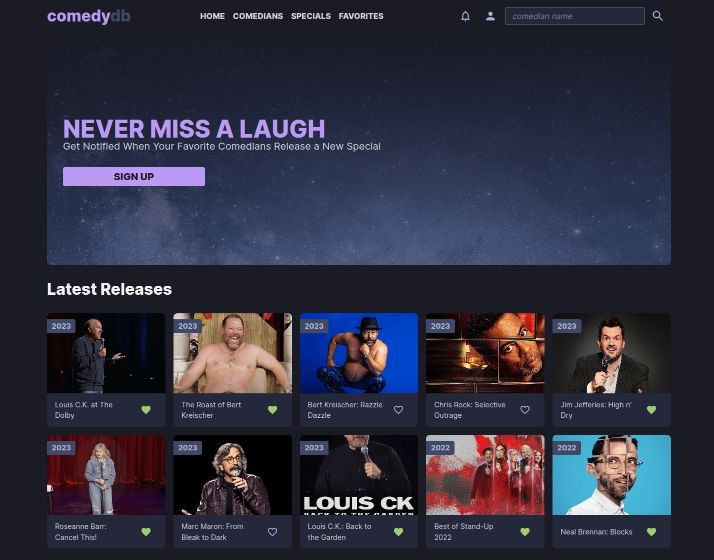
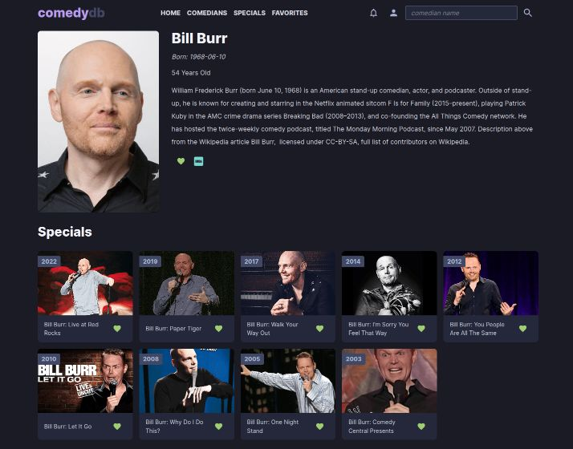

# Hi there 👋

I'm Bryan, an aspiring full stack web developer.

🔭 I’m currently working on completing the NodeJS section in the Odin Project, which focuses on the fundamentals of modern web development. Follow along with [**my progress**](https://github.com/bmilcs/op).

Check out my **[portfolio here ⚡](https://www.bmilcs.com)**.

## Featured Project:

**The Comedy DB** ✨ [Repo](https://github.com/bmilcs/odin-javascript-final-project) | [Live](https://comedy.bmilcs.com)

> Home Page

> Comedian page

<!--
**bmilcs/bmilcs** is a ✨ _special_ ✨ repository because its `README.md` (this file) appears on your GitHub profile.

Here are some ideas to get you started:

- 👯 I’m looking to collaborate on ...
- 🤔 I’m looking for help with ...
- 💬 Ask me about ...
- 📫 How to reach me: ...
- 😄 Pronouns: ...
- ⚡ Fun fact: ...
-->
