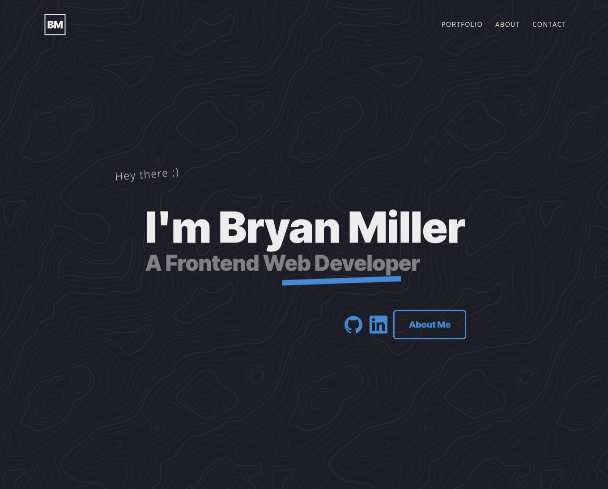
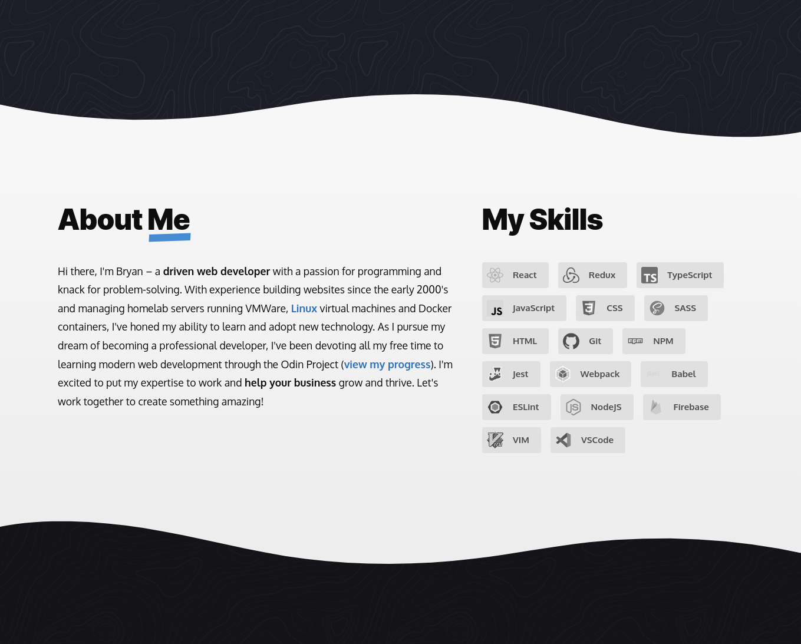
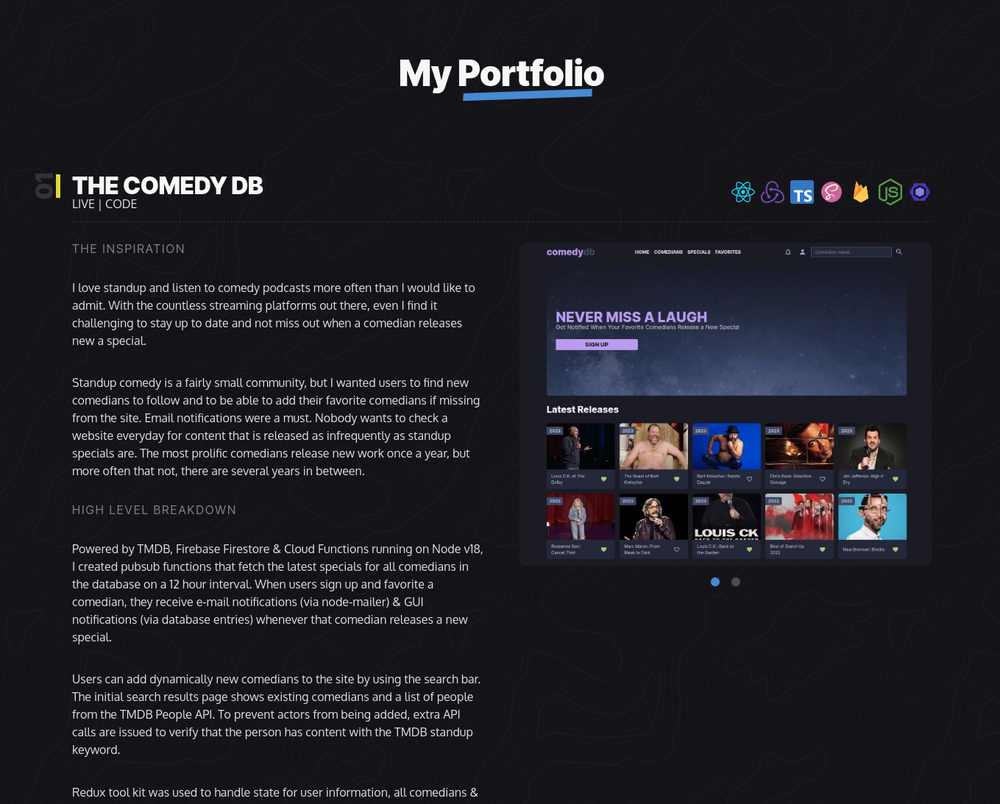
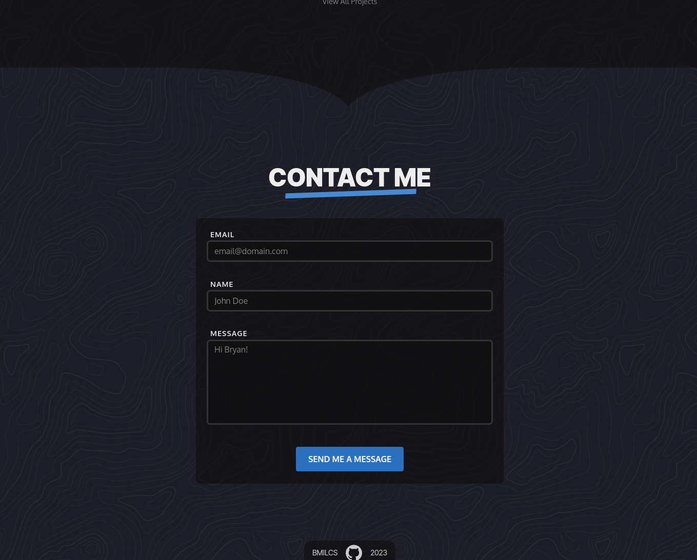
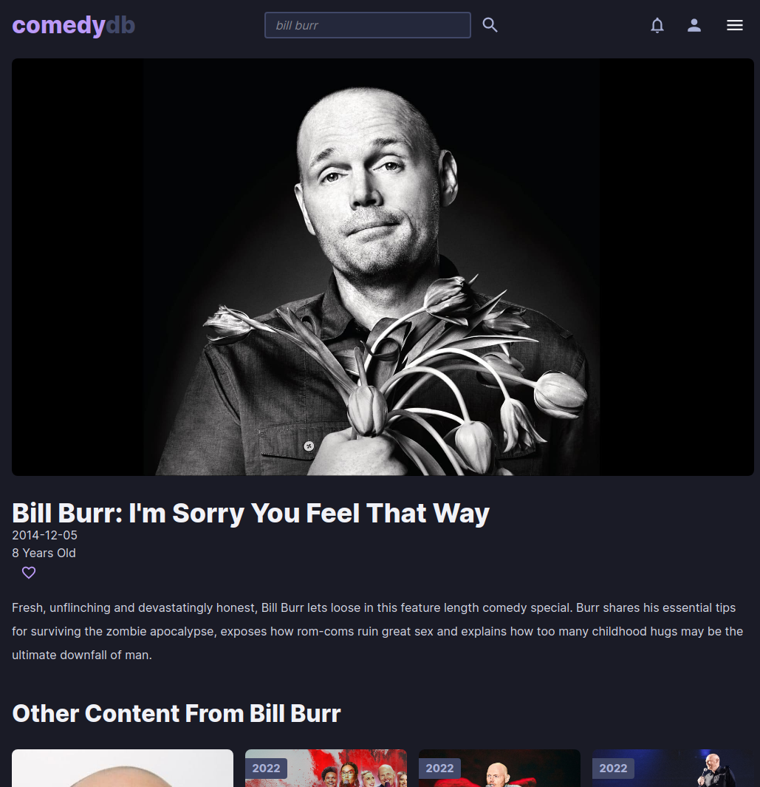
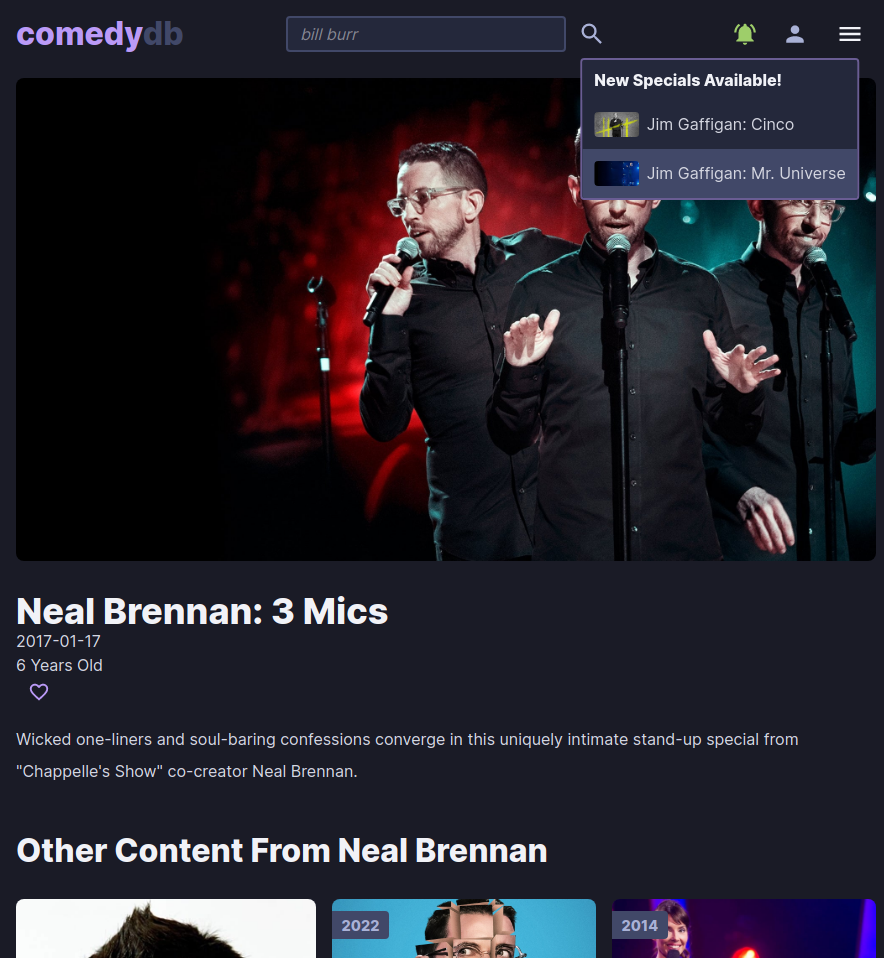
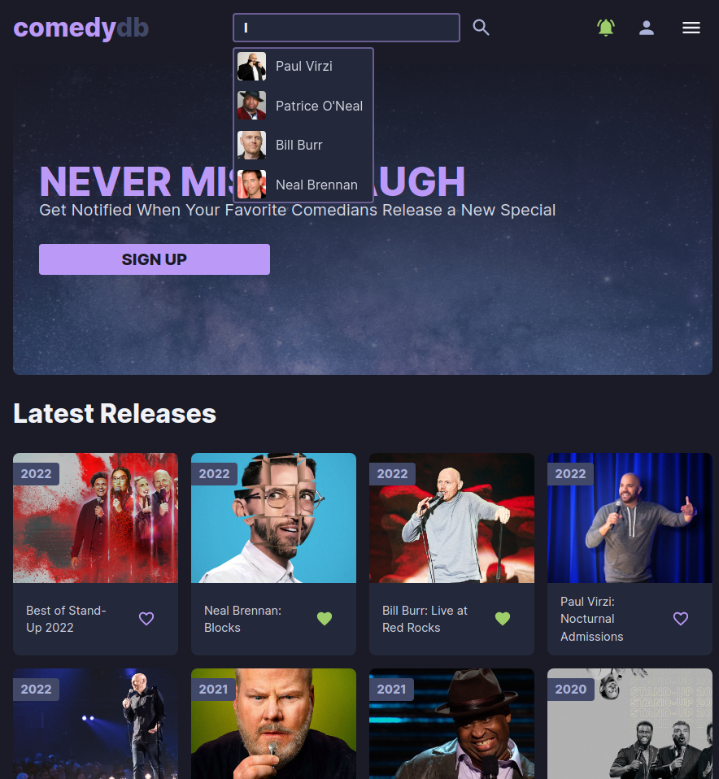

# Hi there 👋

I'm Bryan, an aspiring full stack web developer.

⚡ Check out my **[portfolio here](https://www.bmilcs.com)**.

✨ Follow along with [**my Odin Project progress here**](https://github.com/bmilcs/op).

🔭 I’m currently applying for junior web developer jobs as I work through the Odin Project's [**NodeJS course**](https://www.theodinproject.com/paths/full-stack-javascript/courses/nodejs).

> The Odin Project is a free, open-source curriculum for learning modern web development. It's awesome!

## My Skills

## My Stats

> ABC: **Always Be** ~~Closing~~ **Coding** :)

## ✨ **My Portfolio** ✨ [Repo](https://github.com/bmilcs/bmilcs.github.io) / [Live](https://bmilcs.com)

> Featuring TypeScript, React, SASS, Transitions & Animations, Accessibility, Semantic HTML & Custom Form Validation

## ✨ **The Comedy DB** ✨ [Repo](https://github.com/bmilcs/odin-javascript-final-project) | [Live](https://comedy.bmilcs.com)

> Technology Used: TypeScript, React, Redux, NodeJS, Firebase: FireStore, Cloud Functions, Authentication, TMDB API

> Home Page

> Special Page

> Notifications

> Search

<!--
**bmilcs/bmilcs** is a ✨ _special_ ✨ repository because its `README.md` (this file) appears on your GitHub profile.

Here are some ideas to get you started:

- 👯 I’m looking to collaborate on ...
- 🤔 I’m looking for help with ...
- 💬 Ask me about ...
- 📫 How to reach me: ...
- 😄 Pronouns: ...
- ⚡ Fun fact: ...
-->
